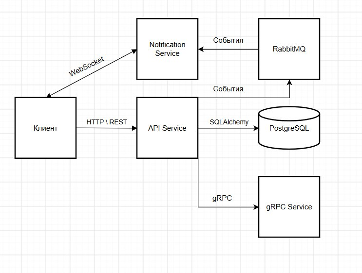
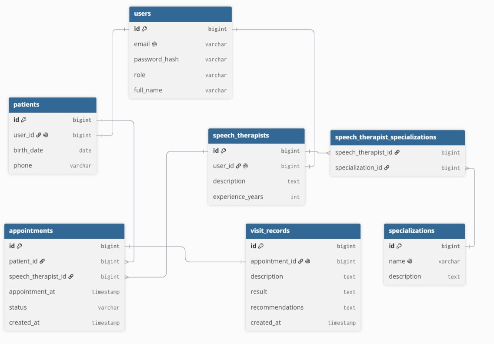

# Информационная система центра логопедии

## Лабораторная работа №0

**Тема:** Выбор и описание предметной области. Проектирование функционала приложения.

**Предметная область:** центр логопедии.

---

## 1. Введение

Центр логопедии оказывает услуги по диагностике и коррекции нарушений речи. В работе центра участвуют пациенты и логопеды. Пациенту необходимо иметь возможность выбрать подходящего специалиста, записаться на приём и впоследствии просматривать историю своих посещений. Логопеду необходимо получать информацию о запланированных приёмах, работать с данными пациентов и фиксировать результаты проведённых занятий.

Разрабатываемая информационная система предназначена для автоматизации записи пациентов на приём к логопедам и ведения истории посещений.

### Бизнес-цель

Сократить время, необходимое для организации записи пациента на приём к логопеду, за счёт предоставления возможности самостоятельно выбрать специалиста и доступное время приёма через информационную систему, а также обеспечить централизованное хранение истории проведённых приёмов.

Для достижения поставленной цели система должна автоматизировать:

- хранение информации о пациентах и логопедах;
- хранение специализаций логопедов;
- просмотр списка специалистов;
- запись пациента на приём;
- просмотр расписания приёмов;
- ведение истории посещений;
- внесение логопедом результатов приёма;
- уведомление пользователей о событиях, связанных с записью на приём.

---

# 2. Роли пользователей

В системе предусмотрены две основные роли.

## 2.1. Пациент

Пациент может:

- зарегистрироваться в системе;
- авторизоваться;
- просматривать список логопедов;
- просматривать информацию о логопедах и их специализациях;
- выбирать специалиста;
- просматривать доступное время;
- записываться на приём;
- просматривать свои предстоящие записи;
- отменять свои записи;
- просматривать историю посещений;
- просматривать результаты завершённых приёмов.

## 2.2. Логопед

Логопед может:

- авторизоваться в системе;
- просматривать собственное расписание;
- просматривать список записанных к нему пациентов;
- получать информацию о конкретном пациенте;
- просматривать историю посещений пациента;
- отмечать приём как завершённый;
- вносить результаты приёма и рекомендации;
- редактировать внесённые результаты.

Таким образом, права доступа к данным зависят от роли пользователя.

---

# 3. Основной функционал приложения

## 3.1. Регистрация и авторизация

Пользователь должен иметь возможность зарегистрироваться и авторизоваться в системе.

После успешной аутентификации пользователь получает доступ к функциям в соответствии со своей ролью.

Для аутентификации предполагается использование JWT-токенов.

---

## 3.2. Работа со специалистами

Пациент может получить список логопедов центра.

Для каждого логопеда отображаются:

- ФИО;
- информация о специалисте;
- специализации;
- стаж работы.

Один логопед может иметь несколько специализаций, например:

- коррекция звукопроизношения;
- коррекция заикания;
- развитие речи;
- коррекция дисграфии;
- коррекция дислексии.

Одна специализация, в свою очередь, может принадлежать нескольким логопедам.

Таким образом, между логопедами и специализациями существует связь **многие-ко-многим**.

---

## 3.3. Запись на приём

Пациент выбирает логопеда и доступное время, после чего создаёт запись на приём.

Запись содержит:

- пациента;
- логопеда;
- дату и время;
- статус записи;
- дату создания записи.

Возможные статусы:

- `scheduled` — приём запланирован;
- `completed` — приём состоялся;
- `cancelled` — запись отменена.

Система не должна позволять создать две записи к одному логопеду на одно и то же время.

---

## 3.4. История посещений

Пациент может просматривать историю собственных посещений.

Логопед может просматривать историю посещений пациента, записанного к нему на приём.

После проведения приёма логопед вносит информацию о его результатах:

- описание проведённого занятия;
- результат;
- рекомендации пациенту.

Эти данные сохраняются в системе и могут использоваться при последующих посещениях.

---

## 3.5. Уведомления

При возникновении значимых событий система формирует уведомления.

Например:

- пациент успешно записался на приём;
- запись была отменена;
- логопед завершил приём и добавил результаты.

Уведомления должны доставляться пользователю в режиме реального времени.

---

# 4. Сценарии использования

## UC-1. Регистрация пациента

**Действующее лицо:** пациент.

**Предусловие:** пользователь не зарегистрирован.

**Сценарий:**

1. Пользователь отправляет данные для регистрации.
2. Система проверяет корректность данных.
3. Система проверяет отсутствие пользователя с таким адресом электронной почты.
4. Создаётся новая учётная запись.
5. Пользователю назначается роль пациента.
6. Создаётся профиль пациента.
7. Система сообщает об успешной регистрации.

**Результат:** пациент зарегистрирован в системе.

---

## UC-2. Авторизация

**Действующее лицо:** пациент или логопед.

**Сценарий:**

1. Пользователь вводит электронную почту и пароль.
2. Система проверяет введённые данные.
3. При успешной проверке система выдаёт JWT-токен.
4. Пользователь получает доступ к функциям своей роли.

**Результат:** пользователь авторизован.

---

## UC-3. Просмотр логопедов

**Действующее лицо:** пациент.

**Сценарий:**

1. Пациент запрашивает список логопедов.
2. Система получает информацию о специалистах из базы данных.
3. Для каждого специалиста система получает его специализации.
4. Пациент получает список логопедов.
5. Пациент выбирает интересующего специалиста и просматривает подробную информацию.

**Результат:** пациент получает информацию, необходимую для выбора логопеда.

---

## UC-4. Запись на приём

**Действующее лицо:** пациент.

**Предусловие:** пациент авторизован.

**Сценарий:**

1. Пациент открывает список логопедов.
2. Выбирает нужного специалиста.
3. Просматривает доступное время.
4. Выбирает дату и время приёма.
5. Отправляет запрос на создание записи.
6. Система проверяет доступность выбранного времени.
7. Система создаёт запись со статусом `scheduled`.
8. Формируется событие о создании записи.
9. Пациент получает подтверждение записи.

**Результат:** создана новая запись на приём.

---

## UC-5. Просмотр предстоящих приёмов пациентом

**Действующее лицо:** пациент.

**Сценарий:**

1. Пациент авторизуется.
2. Запрашивает список своих записей.
3. Система выбирает записи данного пациента из БД.
4. Пациент получает информацию о дате, времени, логопеде и статусе каждой записи.

**Результат:** пациент видит свои предстоящие приёмы.

---

## UC-6. Отмена записи

**Действующее лицо:** пациент.

**Сценарий:**

1. Пациент открывает список своих записей.
2. Выбирает запланированный приём.
3. Нажимает отмену записи.
4. Система изменяет статус записи на `cancelled`.
5. Система формирует событие об отмене записи.
6. Логопед получает соответствующее уведомление.

**Результат:** запись отменена.

---

## UC-7. Проведение приёма

**Действующее лицо:** логопед.

**Предусловие:** существует запланированная запись пациента.

**Сценарий:**

1. Логопед авторизуется.
2. Открывает своё расписание.
3. Выбирает запись пациента.
4. При необходимости просматривает историю предыдущих посещений.
5. После проведения занятия логопед вводит описание результата и рекомендации.
6. Система создаёт запись о результате посещения.
7. Статус приёма изменяется на `completed`.
8. Данные сохраняются в БД.
9. Пациент получает уведомление о появлении результатов приёма.

**Результат:** информация о проведённом приёме сохранена в истории пациента.

---

## UC-8. Просмотр истории посещений

**Действующее лицо:** пациент или логопед.

**Сценарий для пациента:**

1. Пациент авторизуется.
2. Открывает историю посещений.
3. Система получает завершённые приёмы пациента.
4. Пациент просматривает результаты и рекомендации.

**Сценарий для логопеда:**

1. Логопед авторизуется.
2. Выбирает пациента.
3. Запрашивает историю его посещений.
4. Система возвращает данные о предыдущих приёмах.
5. Логопед использует эту информацию при проведении занятия.

---

# 5. Архитектура приложения

Приложение строится как распределённая система и включает несколько взаимодействующих компонентов.

## 5.1. API Service

Основной сервер приложения.

Отвечает за:

- регистрацию и авторизацию;
- обработку HTTP-запросов;
- проверку прав пользователей;
- бизнес-логику;
- работу с базой данных;
- создание и изменение записей на приём;
- работу с историей посещений;
- взаимодействие с остальными сервисами.

Для реализации используется **FastAPI**.

Передаваемые через REST API данные валидируются и сериализуются с помощью **Pydantic**.

---

## 5.2. PostgreSQL

Реляционная СУБД используется для постоянного хранения:

- пользователей;
- пациентов;
- логопедов;
- специализаций;
- записей на приём;
- результатов посещений.

Для взаимодействия Python-приложения с PostgreSQL используется **SQLAlchemy ORM**.

---

## 5.3. gRPC Service

Отдельный сервис дополнительной бизнес-логики.

В рамках предметной области сервис может использоваться для **подбора логопедов по требуемой специализации**.

API Service передаёт сервису параметры поиска пациента, а gRPC Service возвращает подходящих специалистов.

Взаимодействие осуществляется посредством **gRPC**, контракт описывается с помощью **Protocol Buffers**.

---

## 5.4. RabbitMQ

RabbitMQ используется для асинхронной передачи событий между компонентами.

Примеры событий:

- создание записи на приём;
- отмена записи;
- завершение приёма.

API Service публикует событие в брокер сообщений без необходимости ожидать его обработки сервисом уведомлений.

---

## 5.5. Notification Service

Сервис уведомлений получает события из RabbitMQ и передаёт соответствующие уведомления подключённым пользователям.

Для доставки сообщений клиентам в режиме реального времени используется **WebSocket**.

---

## 5.6. JWT

JWT используется для аутентификации и авторизации.

После входа пользователь получает токен, содержащий информацию, необходимую для определения пользователя и его роли.

Защищённые операции API доступны только авторизованным пользователям с соответствующей ролью.

---

## 5.7. Docker

Компоненты распределённой системы предполагается запускать в отдельных Docker-контейнерах.

Итоговая система будет включать контейнеры:

- PostgreSQL;
- API Service;
- gRPC Service;
- RabbitMQ;
- Notification Service.

Для совместного запуска компонентов используется Docker Compose.

---

# 6. Логическая структура базы данных

Основные сущности системы:

1. `User` — учётная запись пользователя;
2. `Patient` — данные пациента;
3. `SpeechTherapist` — данные логопеда;
4. `Specialization` — специализация логопеда;
5. `Appointment` — запись на приём;
6. `VisitRecord` — результат проведённого приёма.

Также используется промежуточная сущность `SpeechTherapistSpecialization` для реализации отношения многие-ко-многим.

## Связи

- один `User` может соответствовать одному `Patient`;
- один `User` может соответствовать одному `SpeechTherapist`;
- один пациент может иметь множество записей на приём;
- один логопед может иметь множество записей на приём;
- один логопед может иметь множество специализаций;
- одна специализация может принадлежать множеству логопедов;
- одна запись на приём может иметь один результат посещения.

### ER-диаграмма

Связь между `SpeechTherapist` и `Specialization` является отношением **многие-ко-многим (M\:N)** и реализуется через промежуточную таблицу `speech_therapist_specializations`.

---

# 7. Физическая структура базы данных

Предполагается использование СУБД PostgreSQL.

## Таблица `users`

| Поле | Тип | Ограничения | Описание |
| -------------------------- | ------------ | ---------------- | ------------- |
| id                         | BIGSERIAL    | PRIMARY KEY      | Идентификатор |
| email                      | VARCHAR(255) | UNIQUE, NOT NULL | Email         |
| password_hash              | VARCHAR(255) | NOT NULL         | Хеш пароля    |
| role                       | VARCHAR(30)  | NOT NULL         | Роль          |
| full_name                  | VARCHAR(255) | NOT NULL         | ФИО           |

---

## Таблица `patients`

| Поле | Тип | Ограничения | Описание |
| -------------------------- | ----------- | -------------------- | ---------------------- |
| id                         | BIGSERIAL   | PRIMARY KEY          | Идентификатор пациента |
| user_id                    | BIGINT      | FK, UNIQUE, NOT NULL | Пользователь           |
| birth_date                 | DATE        | NOT NULL             | Дата рождения          |
| phone                      | VARCHAR(30) |                      | Телефон                |

`user_id` ссылается на `users(id)`.

---

## Таблица `speech_therapists`

| Поле | Тип | Ограничения | Описание |
| -------------------------- | --------- | -------------------- | ------------------------ |
| id                         | BIGSERIAL | PRIMARY KEY          | Идентификатор логопеда   |
| user_id                    | BIGINT    | FK, UNIQUE, NOT NULL | Пользователь             |
| description                | TEXT      |                      | Информация о специалисте |
| experience_years           | INTEGER   | NOT NULL             | Стаж работы              |

`user_id` ссылается на `users(id)`.

---

## Таблица `specializations`

| Поле | Тип | Ограничения | Описание |
| -------------------------- | ------------ | ---------------- | ---------------------- |
| id                         | BIGSERIAL    | PRIMARY KEY      | Идентификатор          |
| name                       | VARCHAR(255) | UNIQUE, NOT NULL | Название специализации |
| description                | TEXT         |                  | Описание               |

---

## Таблица `speech_therapist_specializations`

Промежуточная таблица реализует связь многие-ко-многим между логопедами и специализациями.

| Поле | Тип | Ограничения |
| ------------------- | ------ | ------------ |
| speech_therapist_id | BIGINT | FK, NOT NULL |
| specialization_id   | BIGINT | FK, NOT NULL |

Составной первичный ключ:

`PRIMARY KEY (speech_therapist_id, specialization_id)`

Внешние ключи:

- `speech_therapist_id` → `speech_therapists(id)`;
- `specialization_id` → `specializations(id)`.

---

## Таблица `appointments`

| Поле | Тип | Ограничения | Описание |
| -------------------------- | ----------- | ------------ | -------------------- |
| id                         | BIGSERIAL   | PRIMARY KEY  | Идентификатор записи |
| patient_id                 | BIGINT      | FK, NOT NULL | Пациент              |
| speech_therapist_id        | BIGINT      | FK, NOT NULL | Логопед              |
| appointment_at             | TIMESTAMP   | NOT NULL     | Дата и время         |
| status                     | VARCHAR(30) | NOT NULL     | Статус               |
| created_at                 | TIMESTAMP   | NOT NULL     | Время создания       |

Внешние ключи:

- `patient_id` → `patients(id)`;
- `speech_therapist_id` → `speech_therapists(id)`.

Для предотвращения двойной записи одного специалиста на одно время вводится ограничение уникальности:

`UNIQUE (speech_therapist_id, appointment_at)`

---

## Таблица `visit_records`

| Поле | Тип | Ограничения | Описание |
| -------------------------- | --------- | -------------------- | ----------------- |
| id                         | BIGSERIAL | PRIMARY KEY          | Идентификатор     |
| appointment_id             | BIGINT    | FK, UNIQUE, NOT NULL | Проведённый приём |
| description                | TEXT      |                      | Описание занятия  |
| result                     | TEXT      |                      | Результат         |
| recommendations            | TEXT      |                      | Рекомендации      |
| created_at                 | TIMESTAMP | NOT NULL             | Время создания    |

`appointment_id` ссылается на `appointments(id)`.

Ограничение `UNIQUE` обеспечивает наличие не более одного результата для одного приёма.

---

# 8. Операции с данными

Разработанная структура позволяет выполнять требуемые CRUD-операции.

### Пользователи

- создание пользователя при регистрации;
- получение информации о пользователе;
- изменение данных пользователя.

### Логопеды

- добавление логопеда;
- просмотр логопеда или списка логопедов;
- редактирование информации;
- изменение специализаций.

### Специализации

- создание специализации;
- получение списка специализаций;
- редактирование;
- удаление.

### Записи на приём

- создание записи;
- просмотр записей;
- изменение статуса;
- отмена записи.

### Результаты посещений

- создание результата после проведения приёма;
- просмотр истории;
- редактирование результата и рекомендаций.

Таким образом, система обеспечивает чтение, запись и редактирование информации в базе данных.

---

# 9. Соответствие формальным требованиям

| Требование | Реализация |
| ----------------------- | ------------------------------------------------------------------------ |
| Чтение данных из БД     | Просмотр логопедов, записей, истории посещений                           |
| Запись данных в БД      | Регистрация, создание записи на приём, создание результата посещения     |
| Редактирование данных   | Изменение записи, профиля и результатов посещения                        |
| Не менее двух ролей     | Пациент и логопед                                                        |
| Не менее трёх сущностей | User, Patient, SpeechTherapist, Specialization, Appointment, VisitRecord |
| Связь многие-ко-многим  | SpeechTherapist ↔ Specialization                                         |
| Логическая схема БД     | Представлена ER-диаграммой                                               |
| Физическая схема БД     | Описаны PostgreSQL-таблицы, типы, PK, FK и ограничения                   |

---

# 10. Используемые технологии

| Технология | Назначение |
| -------------------- | -------------------------------------- |
| Python               | Язык программирования                  |
| PostgreSQL           | Реляционная база данных                |
| SQLAlchemy           | ORM и взаимодействие с БД              |
| Pydantic             | Валидация и сериализация данных        |
| FastAPI              | Реализация REST API                    |
| JWT                  | Аутентификация и авторизация           |
| gRPC                 | Синхронное межсервисное взаимодействие |
| Protocol Buffers     | Описание контрактов gRPC               |
| RabbitMQ             | Асинхронная передача событий           |
| WebSocket            | Уведомления в реальном времени         |
| Docker               | Контейнеризация                        |
| Docker Compose       | Совместный запуск компонентов          |

---

# 11. Результат проектирования

В рамках лабораторной работы выбрана предметная область **«Центр логопедии»** и сформулированы требования к информационной системе.

Разработанное приложение должно автоматизировать взаимодействие пациентов и логопедов: предоставлять пациентам возможность выбирать специалиста и записываться на приём, а логопедам — работать со своим расписанием, просматривать историю пациентов и фиксировать результаты занятий.

Спроектированная база данных содержит необходимые сущности и связи для реализации указанного функционала, включая отношение многие-ко-многим между логопедами и их специализациями.

Архитектура предусматривает дальнейшее развитие проекта в виде распределённой системы с REST API, отдельным gRPC-сервисом, асинхронным обменом сообщениями и доставкой уведомлений в режиме реального времени.

